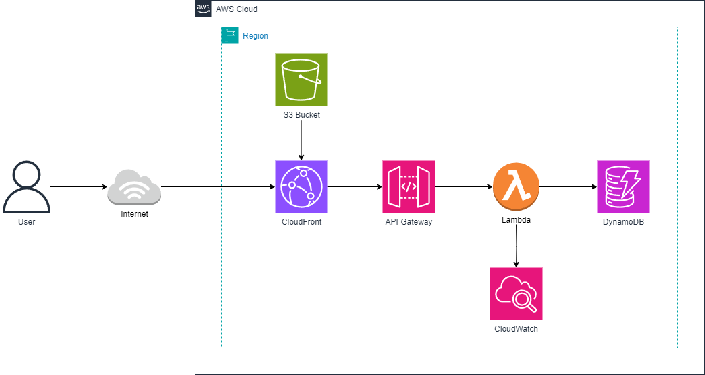
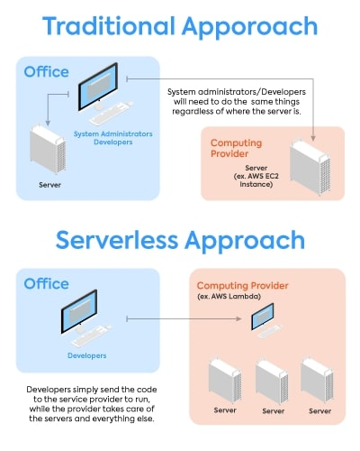
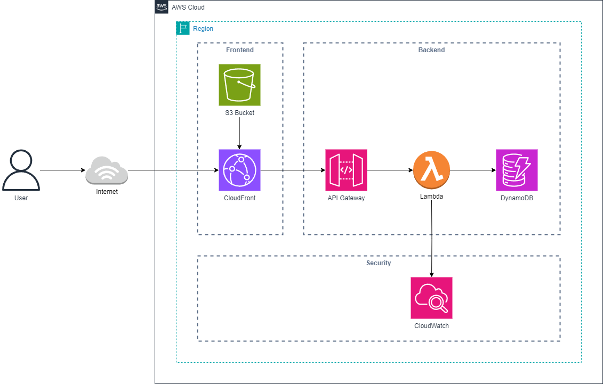

<a name="readme-top"></a>

<!-- PROJECT LOGO -->
<br />
<div align="center">
  <a href="https://registry.terraform.io/providers/hashicorp/aws/latest/docs">
    
  </a>

  <h3 align="center">AWS Serverless with Terraform</h3>

  <p align="center">
    Introduction to serverless architecture using Terraform!
    <br />
    <a href="https://registry.terraform.io/providers/hashicorp/aws/latest/docs"><strong>Terraform Documentation »</strong></a>
  </p>
</div>

<!-- TABLE OF CONTENTS -->
<details>
  <summary>Table of Contents</summary>
  <ol>
    <li>
      <a href="#about-the-project">About The Project</a>
      <ul>
        <li><a href="#serverless-architecture">Serverless Architecture</a></li>
        <ul>
          <li><a href="#frontend">Frontend</a></li>
          <li><a href="#backend">Backend</a></li>
          <li><a href="#security">Security</a></li>
        </ul>
        <li><a href="#why-terraform">Why Terraform</a></li>
        <li><a href="#manual-setup">Manual Setup</a></li>
        <li><a href="#terraform-setup">Terraform Setup</a></li>
        <li><a href="#manual-vs-terraform-setup">Manual vs Terraform Setup</a></li>
        <li><a href="#terraform-resources">Terraform Resources</a></li>
        <li><a href="#built-with">Built With</a></li>
      </ul>
    </li>
    <li>
      <a href="#getting-started">Getting Started</a>
      <ul>
        <li><a href="#prerequisites">Prerequisites</a></li>
        <li>
          <a href="#installation">Installation</a>
          <ul>
            <li><a href="#aws-cli">AWS CLI</a></li>
            <li><a href="#terraform">Terraform</a></li>
          </ul>
          <li><a href="#setup">Setup</a></li>
          <ul>
            <li><a href="#react-app-initialization">React App Initialization</a></li>
            <li><a href="#project-initialization">Project Initialization</a></li>
          </ul>
        </li>
      </ul>
    </li>
    <li><a href="#terraform-structure">Terraform Structure</a></li>
    <li><a href="#guide-main-directory">Guide: Main Directory</a></li>
    <li><a href="#guide-s3-bucket">Guide: S3 Bucket</a></li>
    <li><a href="#guide-cloudfront">Guide: CloudFront</a></li>
    <li><a href="#guide-dynamodb">Guide: DynamoDB</a></li>
    <li><a href="#guide-lambda">Guide: Lambda</a></li>
    <li><a href="#guide-api-gateway">Guide: API Gateway</a></li>
    <li><a href="#guide-api-gateway-methods">Guide: API Gateway Methods</a></li>
    <li><a href="#guide-api-gateway-deploy">Guide: API Gateway Deploy</a></li>
  </ol>
</details>

## About The Project


This project uses Terraform to simplify resource management and deployment, with a focus on deploying AWS services, specially serverless architecture.

In serverless architecture, the cloud provider handles infrastructure management, freeing developers to focus solely on writing code to implement business logic. While in traditional architecture, developers are responsible for managing and provisioning servers, requiring additional considerations for scalability and maintenance.

Serverless architecture offers benefits like automatic scalability, cost efficiency through pay-as-you-go models, and reduced maintenance tasks. However, it also presents challenges such as cold start latency, resource limits, and potential vendor lock-in.

<div align="center">
    
</div>

The image above offers a high-level overview of the differences between traditional and serverless computing. It emphasizes that with a traditional architecture, you're tasked with setting up servers for your applications, whereas with serverless, you delegate this responsibility to a third-party service.

<p align="right">(<a href="#readme-top">back to top</a>)</p>

### Serverless Architecture


#### Frontend

The **S3 bucket** hosts your frontend files and serves as static website hosting. **CloudFront** acts as a content delivery network for the content stored in the S3 bucket. 

#### Backend

**API Gateway** serves as the entry point for your backend APIs, providing a managed API infrastructure. **Lambda** functions are used to implement the business logic of your APIs, enabling serverless execution and scalability. **DynamoDB** acts as a NoSQL database for storing and retrieving data, providing fast and reliable access to your application's data. 

#### Security

**CloudWatch** monitors and logs AWS resources, ensuring continuous security monitoring and threat detection.

<p align="right">(<a href="#readme-top">back to top</a>)</p>

### Why Terraform?
Terraform is an Infrastructure as Code (IaC) tool that simplifies the standardization of infrastructure definition, provisioning, and management across different cloud providers and environments. It streamlines infrastructure setup by utilizing machine-readable files (like HCL, YAML, XML, etc.) instead of manual processes or interactive configuration tools.

Terraform benefits web development with automated environment setup, consistent configurations across environments, scalable infrastructure handling, seamless integration with CI/CD pipelines, and cost optimization through efficient resource management. Additionally, it can leverage serverless architecture setups, allowing developers to easily deploy and manage serverless functions and resources alongside traditional infrastructure components.

<p align="right">(<a href="#readme-top">back to top</a>)</p>

### Manual Setup
<div align="center">

</div>

### Terraform Setup
<div align="center">

</div>

### Manual vs Terraform Setup
The provided gifs illustrate two setup configurations. With Terraform setup, you can configure resources within an IDE, while manual setup requires the use of the provider's GUI. For simple resource management, manual setup could be ideal. However, for larger infrastructures, Terraform outperforms manual setup due to less navigation via GUI, as everything is centralized in one location.

<p align="right">(<a href="#readme-top">back to top</a>)</p>

### Terraform Resources
The project will concentrate on various AWS resources, with a provided link to documentation below:

* <a href="https://registry.terraform.io/providers/hashicorp/aws/latest/docs/resources/s3_bucket" ></a>
* <a href="https://registry.terraform.io/providers/hashicorp/aws/latest/docs/resources/cloudfront_distribution" ></a>
* <a href="https://registry.terraform.io/providers/hashicorp/aws/latest/docs/resources/api_gateway_rest_api" ></a>
* <a href="https://registry.terraform.io/providers/hashicorp/aws/3.29.1/docs/resources/cloudwatch_log_group" ></a>
* <a href="https://registry.terraform.io/providers/hashicorp/aws/latest/docs/resources/lambda_function" ></a>
* <a href="https://registry.terraform.io/providers/hashicorp/aws/latest/docs/resources/dynamodb_table" ></a>

### Built With
The project will use three resources, with a provided link to website:

* <a href="https://react.dev/" ></a>
* <a href="https://aws.amazon.com/free/?gclid=Cj0KCQjwlN6wBhCcARIsAKZvD5jwIgWrykDmG7eeAuycctzjjgnZaLAsRfAjl58i1fZFUzBmAZ14aicaAgj7EALw_wcB&trk=f181118c-0869-454a-84d2-63d0cf7146e3&sc_channel=ps&ef_id=Cj0KCQjwlN6wBhCcARIsAKZvD5jwIgWrykDmG7eeAuycctzjjgnZaLAsRfAjl58i1fZFUzBmAZ14aicaAgj7EALw_wcB:G:s&s_kwcid=AL!4422!3!638125895456!e!!g!!aws!19068271377!141241695742&all-free-tier.sort-by=item.additionalFields.SortRank&all-free-tier.sort-order=asc&awsf.Free%20Tier%20Types=*all&awsf.Free%20Tier%20Categories=*all" ></a>
* <a href="https://www.terraform.io/" ></a>

<p align="right">(<a href="#readme-top">back to top</a>)</p>

## Getting Started

### Prerequisites

<table>
    <tr>
        <th>Prerequisite</th>
        <th>Description</th>
    </tr>
    <tr>
        <td>Text Editor or IDE</td>
        <td>Choose a text editor or integrated development environment (IDE) for editing Terraform configuration files. <a href="https://code.visualstudio.com/">Visual Studio Code</a> is recommended, but you can also use <a href="https://atom.io/">Atom</a>, <a href="https://www.jetbrains.com/idea/?var=1">Intellij</a>, or <a href="https://www.sublimetext.com/">Sublime Text</a>.</td>
    </tr>
    <tr>
        <td>Extensions</td>
        <td>If using Visual Studio Code, consider installing <a href="https://marketplace.visualstudio.com/items?itemName=HashiCorp.terraform">HashiCorp Terraform</a> and <a href="https://marketplace.visualstudio.com/items?itemName=hashicorp.hcl">HashiCorp HCL</a> to enhance your development experience.</td>
    </tr>
    <tr>
        <td>Path Configuration</td>
        <td>Make sure you have access to add the directory containing the Terraform binary to your system's PATH environment variable on your computer.</td>
    </tr>
    <tr>
        <td>AWS Cloud Provider Credentials</td>
        <td>Ensure you've set up the required AWS credentials or authentication mechanisms.</td>
    </tr>
    <tr>
        <td>npm/Node.js</td>
        <td>Install <a href="https://www.npmjs.com/">npm</a> and <a href="https://nodejs.org/en">Node.js</a> on your system for managing dependencies and running JavaScript-based tools.</td>
    </tr>
</table>


### Installation

**Note:** The instructions provided here are from the official website's installation guide. You can find additional options on the website.</br>
* <a href="https://docs.aws.amazon.com/cli/latest/userguide/getting-started-install.html">AWS CLI</a>
* <a href="https://developer.hashicorp.com/terraform/tutorials/aws-get-started/install-cli">Terraform</a>

#### AWS CLI
<details>
  <summary>Windows</summary>
  <ol>
    <li>Download and run the AWS CLI MSI installer for Windows (64-bit): <a href="https://awscli.amazonaws.com/AWSCLIV2.msi">https://awscli.amazonaws.com/AWSCLIV2.msi</a>
    </br><b>Alternatively</b>, you can run the msiexec command to run the MSI installer:
      <pre><code>msiexec.exe /i https://awscli.amazonaws.com/AWSCLIV2.msi</code></pre>
    </li>
    <li>To confirm the installation, open the Start menu, search for cmd to open a command prompt window, and at the command prompt use the aws --version command:
      <pre><code>aws --version</code></pre>
    </li>
  </ol>
</details>

<details>
  <summary>MacOS</summary>
  <ol>
    <li>In your browser, download the macOS <code>pkg</code> file: <a href="https://awscli.amazonaws.com/AWSCLIV2.pkg">https://awscli.amazonaws.com/AWSCLIV2.pkg</a></li>
    <li>Run your downloaded file and follow the on-screen instructions. You can choose to install the AWS CLI in the following ways:
      <ul>
        <li><strong>For all users on the computer (requires sudo)</strong>
          <ul>
            <li>You can install to any folder, or choose the recommended default folder of <code>/usr/local/aws-cli</code>.</li>
            <li>The installer automatically creates a symlink at <code>/usr/local/bin/aws</code> that links to the main program in the installation folder you chose.</li>
          </ul>
        </li>
        <li><strong>For only the current user (doesn't require sudo)</strong>
          <ul>
            <li>You can install to any folder to which you have write permission.</li>
            <li>Due to standard user permissions, after the installer finishes, you must manually create a symlink file in your <code>$PATH</code> that points to the <code>aws</code> and <code>aws_completer</code> programs by using the following commands at the command prompt. If your <code>$PATH</code> includes a folder you can write to, you can run the following command without <code>sudo</code> if you specify that folder as the target's path. If you don't have a writable folder in your <code>$PATH</code>, you must use <code>sudo</code> in the commands to get permissions to write to the specified target folder. The default location for a symlink is <code>/usr/local/bin/</code>.
              <pre><code>sudo ln -s /folder/installed/aws-cli/aws /usr/local/bin/aws
sudo ln -s /folder/installed/aws-cli/aws_completer /usr/local/bin/aws_completer</code></pre>
            </li>
          </ul>
        </li>
      </ul>
    </li>
    <li>To verify that the shell can find and run the <code>aws</code> command in your <code>$PATH</code>, use the following commands.
      <pre><code>which aws
aws --version</code></pre>
    </li>
  </ol>
</details>

#### Terraform

<details>
  <summary>Pre-compiled binary</summary>
  <ol>
    <li>To install Terraform, find the <a href="https://developer.hashicorp.com/terraform/install">appropriate package</a> for your system and download it as a zip archive.</li>
    <li>After downloading Terraform, unzip the package. Terraform runs as a single binary named <code>terraform</code>. Any other files in the package can be safely removed and Terraform will still function.</li>
    <li>Finally, make sure that the <code>terraform</code> binary is available on your <code>$PATH</code>. This process will differ depending on your operating system.
      <details>
        <summary>Windows</summary>
        <ol>
          <li>Add the folder location to your <code>$PATH</code> variable, e.g., <code>Control Panel</code> &rarr; <code>System</code> &rarr; <code>System settings</code> &rarr; <code>Environment Variables</code>.</li>
          <li>In System Variables, select <code>Path</code>, click <code>Edit</code>, click <code>New</code>, enter the location of the Terraform .exe, e.g., <code>C:\Apps\Terraform</code>, then click <code>OK</code>.</li>
        </ol>
      </details>
      <details>
        <summary>macOS</summary>
        <ol>
          <li>Print a colon-separated list of locations in your <code>$PATH</code>.
            <pre><code>echo $PATH</code></pre>
          </li>
          <li>Move the Terraform binary to one of the listed locations. This command assumes that the binary is currently in your downloads folder and that your <code>$PATH</code> includes <code>/usr/local/bin</code>, but you can customize it if your locations are different.
            <pre><code>mv ~/Downloads/terraform /usr/local/bin/</code></pre>
          </li>
        </ol>
      </details>
    </li>
    <li>To verify that the shell can find and run the <code>terraform</code> command in your <code>$PATH</code>, use the following command.
      <pre><code>terraform -help</code></pre>
    </li>
  </ol>
</details>

<details>
  <summary>Homebrew on macOS</summary>
  <ol>
    <li>Install Homebrew from <a href="https://brew.sh/">https://brew.sh/</a>
    <li>Now, install Terraform using command line.
    <pre><code>brew install terraform</code></pre>
    </li>
  </ol>
</details>

<details>
  <summary>Choclatey on Windows</summary>
  <ol>
    <li>Install Chocolatey from <a href="https://chocolatey.org/install">https://chocolatey.org/install</a>
    <li>Now, install Terraform using command line.
    <pre><code>choco install terraform</code></pre></li>
  </ol>
</details>

### Setup

#### React App Initialization
1. Clone the repo
```sh
git clone https://github.com/jgconn/aws-serverless-terraform.git
```
2. Move to `client` directory in repo
```sh
cd .\client\
```
3. Run `npm install`
```sh
npm install
```
4. Run `npm run build`
```sh
npm run build
```

#### Project Initialization

**Note:** If you've already cloned the repository from *React App Initialization*, you can skip step 1.

1. Clone the repo
```sh
git clone https://github.com/jgconn/aws-serverless-terraform.git
```
2. Move to `infrastructure` directory in repo
```sh
cd .\infrastructure\
```
3. Run `aws configure` in command line
```sh
AWS Access Key ID: MYACCESSKEY
AWS Secret Access Key: MYSECRETKEY
Default region name [us-west-2]: ap-southeast-2
Default output format [None]: json
```
<a name="step4"></a>

4. Create a <a href="#tfvars">terraform.tfvars</a> file and input variables
```hcl
region           = "REGION_NAME"
account_id       = "ACCOUNT_ID"
bucket_name      = "BUCKET_NAME"   // Choose any UNIQUE name
website_suffix   = "index.html"    // Main .html file 
api_gateway_name = "API_NAME"      // Choose any UNIQUE name
```
5. Move to `server` directory & paste `bucket_name` into `lambda-get.py` & `lambda-post.py`
```python
table = dynamodb.Table('BUCKET_NAME')
```
6. Make sure you're still in `infrastructure` directory in repo or
```sh
cd .\infrastructure\
```
7. Initiate terraform directory
```sh
terraform init
```
8. [Optional] Format terraform directory
```sh
terraform fmt
```
9. [Optional] Validate terraform directory
```sh
terraform validate
```
10. [Optional] Plan terraform script to preview changes
```sh
terraform plan
```
11. Execute terraform script
```sh
terraform apply
```
<a name="step12"></a>

12. Once changes have been made, copy the output `stage_api_url` and save `cloudfront_url` for later use
```sh
Outputs:

cloudfront_url = "example.abc123.net"
stage_api_url = "https://example_abc123/dev"
```
13. Move to `client` directory in repo
```sh
cd ..
cd .\client\
```
14. Paste `stage_api_url` into `.\src\components\Messagelist.js`
```js
const axiosInstance = axios.create({
  baseURL: 'https://example_abc123/dev',
});
```
15. Paste `stage_api_url` into `.\src\api.js`
```js
const axiosInstance = axios.create({
  baseURL: 'https://example_abc123/dev',
});
```
16. Run `npm run build`
```sh
npm run build
```
17. Run `s3 sync` (`BUCKET_NAME` from <a href="#step4">step4</a>)
```sh
aws s3 sync build/ s3://BUCKET_NAME
```
18. Use `cloudfront_url` from <a href="#step12">step12</a> and paste it into browser
```sh
cloudfront_url = "example.abc123.net"
```
19. Remove all AWS resources created with terraform when finished
```sh
terraform destroy
```

**Note:** Steps 6 to 8 are not required but are best practices.

<p align="right">(<a href="#readme-top">back to top</a>)</p>

## Terraform Structure

The initial project directory should include four .tf files, one .tfvars file, and a modules directory.</br>
**Note:** The `terraform.tfvars` file should not be publicly accessible and should be included in your `.gitignore`.

<table>
    <tr>
        <th>File</th>
        <th>Description</th>
    </tr>
  <tr>
        <td><a href="./infrastructure/provider.tf">provider.tf</a></td>
        <td>Defines the configuration for your Terraform provider(s), specifying the cloud or infrastructure platform to be used.</td>
    </tr>
    <tr>
        <td><a href="./infrastructure/main.tf">main.tf</a></td>
        <td>Contains the main configuration for your infrastructure resources.</td>
    </tr>
    <tr>
        <td><a href="./infrastructure/outputs.tf">outputs.tf</a></td>
        <td>Contains variable declarations. Variables are used to parameterize your Terraform configurations, allowing you to customize settings without modifying the main configuration.</td>
    </tr>
    <tr>
        <td><a href="./infrastructure/variables.tf">variables.tf</a></td>
        <td>Contains output declarations. Outputs are used to expose values from your infrastructure after it's been created.</td>
    </tr>
    <tr>
        <td><a href="https://registry.terraform.io/providers/terraform-redhat/rhcs/latest/docs/guides/terraform-vars">terraform.tfvars</a></td>
        <td>Defines values for input variables. This interacts with your variables.tf file.</td>
    </tr>
    <tr>
        <td><a href="./infrastructure/modules">modules</a></td>
        <td>Modules are a way to organize, reuse, and encapsulate Terraform configurations. They allow you to create reusable units of infrastructure.</td>
    </tr>
</table>

Below is the template Terraform directory:

```
project-root/
│
├── modules/
│   ├── module1/
│   │   ├── main.tf
│   │   ├── outputs.tf
│   │   └── variables.tf
│   │
│   ├── module2/
│   │   ├── main.tf
│   │   ├── outputs.tf
│   │   └── variables.tf
│   │
│   └── ...
│
├── main.tf
├── outputs.tf
├── provider.tf
├── variables.tf
└── terraform.tfvars
```

<p align="right">(<a href="#readme-top">back to top</a>)</p>

## Guide Main Directory

### variables.tf

In your main directory, create a `variables.tf` file and insert code:

```hcl
variable "region" {
  description = "Name of the AWS region"
  type        = string
}

variable "account_id" {
  description = "Account ID of AWS account associated with AWS access key & secret key"
  type        = string
}


variable "bucket_name" {
  description = "Name of the S3 bucket"
  type        = string
}

variable "website_suffix" {
  description = "Name of the file for website suffix"
  type        = string
}

variable "api_gateway_name" {
  description = "Name of API Gateway"
  type        = string
}
```
<a name="tfvars"></a>

### terraform.tfvars

In your main directory, create a `terraform.tfvars` file and insert code:

```hcl
region           = "REGION_NAME"
account_id       = "ACCOUNT_ID"
bucket_name      = "BUCKET_NAME"   // Choose any UNIQUE name
website_suffix   = "index.html"    // Main .html file 
api_gateway_name = "API_NAME"      // Choose any UNIQUE name
```

### provider.tf
In your main directory, create a `provider.tf` file and insert code:

```hcl
terraform {
  required_providers {
    aws = {
      source  = "hashicorp/aws"
      version = "~> 5.32.1"
    }
  }
}

provider "aws" {
  region = "ap-southeast-2"
}
```

### main.tf

In your main directory, create a `main.tf` file and insert code:
```hcl
# 1. Create S3 Bucket for client side (frontend) files.

# 2. Upload files to S3 Bucket.
# moved to S3 module

# 3. Create CloudFront Distribution for content delivery.

# 4. Create S3 Bucket policy to allow CloudFront to access files.
# moved to CloudFront module

# 5. Create DynamoDB (database) to host user data.

# 6. Create Lambda Functions (backend) to process user data.

# 7. Create API Gateway for API interaction between frontend and backend.

# 8. Deploy API Gateway

# 9. You will need to add api keys to client then update S3 Bucket with aws s3 sync build/ s3://bucket_name
```

### outputs.tf
**Note:** Please create `outputs.tf` after all modules have been created. This ensures that you can pull data from subsequent modules without throwing errors.</br>

In your main directory, create a `outputs.tf` file and insert code:
```hcl
output "stage_api_url" {
  value = module.api_gateway_deply.stage_api_url
}

output "cloudfront_url" {
  value = module.cloudfront.cloudfront_url
}
```

<p align="right">(<a href="#readme-top">back to top</a>)</p>

## Guide S3 Bucket

> An S3 Bucket (Simple Storage Service) is a storage resource provided by AWS.

Create a module directory in `modules/` named **s3**.

### variables.tf

In your s3 module, create a `variables.tf` file and insert code:

```hcl
variable "bucket_name" {
  description = "Name of the S3 bucket"
  type        = string
}

variable "website_suffix" {
  description = "Name of the file for website suffix"
  type        = string
}
```

### main.tf

In your s3 module, create a `main.tf` file and insert code:

`aws_s3_bucket` creates a bucket to hold files.
```hcl
resource "aws_s3_bucket" "s3" {
  bucket = var.bucket_name

  tags = {
    Name = var.bucket_name
  }
}
```

</br>`aws_s3_bucket_website_configuration"` allows bucket to act as a static website.
```hcl
resource "aws_s3_bucket_website_configuration" "s3_host_config" {
  bucket = aws_s3_bucket.s3.id
  index_document {
    suffix = var.website_suffix
  }
}
```

</br>`aws_s3_bucket_ownership_controls` sets bucket ownership and gives full control to whoever created bucket.
```hcl
resource "aws_s3_bucket_ownership_controls" "ownership_controls" {
  bucket = aws_s3_bucket.s3.id
  rule {
    object_ownership = "BucketOwnerPreferred"
  }
}
```

</br>`aws_s3_bucket_acl` grants access to bucket and is set as **private**.
```hcl
resource "aws_s3_bucket_acl" "s3_bucket_acl" {
  depends_on = [aws_s3_bucket_ownership_controls.ownership_controls]
  bucket     = aws_s3_bucket.s3.id
  acl        = "private"
}
```

</br>`aws_s3_object` looks for frontend files and uploads to S3 Bucket and sets content type using `locals`.
</br>**Note:** Add content type to `content_type_map` if frontend requires additional mapping.
```hcl
locals {
  content_type_map = {
    "js"   = "application/javascript"
    "html" = "text/html"
    "css"  = "text/css"
    "svg"  = "image/svg+xml"
  }
}

resource "aws_s3_object" "object" {
  bucket = aws_s3_bucket.s3.bucket

  for_each = fileset("../client/build/", "**/*.*")

  key    = each.value
  source = "../client/build/${each.value}"
  etag   = filemd5("../client/build/${each.value}")

  content_type = lookup(local.content_type_map, reverse(split(".", each.value))[0], "binary/octet-stream")
}
```

</br>`aws_s3_bucket_cors_configuration` creates cors rules and allows API Gateway & CloudFront to interact with bucket.
```hcl
resource "aws_s3_bucket_cors_configuration" "name" {
  bucket = aws_s3_bucket.s3.id

  cors_rule {
    allowed_headers = ["*"]
    allowed_methods = ["GET", "HEAD", "POST", "PUT", "DELETE"]
    allowed_origins = ["*"]
    expose_headers  = []
  }
}
```

### outputs.tf

In your s3 module, create a `outputs.tf` file and insert code:

```hcl
output "s3_bucket" {
  value = aws_s3_bucket.s3.bucket
}

output "s3_domain_name" {
  value = aws_s3_bucket.s3.bucket_regional_domain_name
}

output "s3_id" {
  value = aws_s3_bucket.s3.id
}

output "s3_arn" {
  value = aws_s3_bucket.s3.arn
}
```

### main.tf (main directory)

Naviagte back to main directory where `main.tf` is and insert code:

`module "s3"` Allows your main directory to deploy resouces inside s3 module.
```hcl
# 1. Create S3 Bucket for client side (frontend) files.
module "s3" {
  source = "./modules/s3"

  bucket_name    = var.bucket_name
  website_suffix = var.website_suffix
}
# 2. Upload files to S3 Bucket.
# moved to module
```

<p align="right">(<a href="#readme-top">back to top</a>)</p>

## Guide CloudFront

> CloudFront is a content delivery network provided by AWS, its main function is to deliver content such as webpages. You can configure your CloudFront to serve S3 bucket content using edge locations (nearest location to user) to reduce latency and improve performance. 

Create a module directory in `modules/` named **cloudfront**.

### variables.tf

In your cloudfront module, create a `variables.tf` file and insert code:

```hcl
variable "s3_domain_name" {
  description = "Name of S3 domain name"
  type        = string
}

variable "s3_id" {
  description = "ID of S3 Bucket"
  type        = string
}

variable "s3_arn" {
  description = "ARN of S3 Bucket"
  type        = string
}

variable "s3_name" {
  description = "Name of S3 Bucket"
  type        = string
}
```

### main.tf

In your cloudfront module, create a `main.tf` file and insert code:

`aws_cloudfront_origin_access_control` configures access control settings for your CloudFront to ensure your S3 Bucket is properly signed and authenticated.
```hcl
resource "aws_cloudfront_origin_access_control" "cloudfront_oac" {
  name                              = "${var.s3_name}-OAC"
  description                       = "The origin access control configuration for the Cloudfront distribution"
  origin_access_control_origin_type = "s3"
  signing_behavior                  = "always"
  signing_protocol                  = "sigv4"
}
```

</br>`aws_cloudfront_distribution` creates a CloudFront distribution to serve your static content from your S3 Bucket with specified caching, origin settings and SSL/TLS configuration.
```hcl
fix codeblock
```

</br>`aws_s3_bucket_policy` grants CloudFront read access to your files within your S3 Bucket.
```hcl
resource "aws_s3_bucket_policy" "bucket_policy" {
  depends_on = [ aws_cloudfront_distribution.website_cdn ]
  bucket = var.s3_id
  policy = jsonencode({
    "Version" : "2012-10-17",
    "Statement" : [
      {
        "Sid" : "AllowCloudFrontServicePrincipalReadOnly",
        "Effect" : "Allow",
        "Principal" : {
          "Service" : "cloudfront.amazonaws.com"
        },
        "Action" : "s3:GetObject",
        "Resource" : "${var.s3_arn}/*",
        "Condition" : {
          "StringEquals" : {
            "AWS:SourceArn" : "${aws_cloudfront_distribution.website_cdn.arn}"
          }
        }
      }
    ]
  })
}
```

### main.tf (main directory)

Naviagte back to main directory where `main.tf` is and insert code:
`module "cloudfront"` Allows your main directory to deploy resouces inside cloudfront module.
```hcl
# 3. Create CloudFront Distribution for content delivery.
module "cloudfront" {
  source         = "./modules/cloudfront"
  s3_id          = module.s3.s3_id
  s3_arn         = module.s3.s3_arn
  s3_domain_name = module.s3.s3_domain_name
  s3_name        = module.s3.s3_bucket
}

# 4. Create S3 Bucket policy to allow CloudFront to access files.
# moved to module
```

<p align="right">(<a href="#readme-top">back to top</a>)</p>

## Guide DynamoDB

> DynamoDB is a fully managed NoSQL database service provided by AWS.

Create a module directory in `modules/` named **dynamodb**.

### variables.tf

In your dynamodb module, create a `variables.tf` file and insert code:

```hcl
variable "table_name" {
  description = "Name of DynamoDB"
  type        = string
}
```

### main.tf

In your dynamodb module, create a `main.tf` file and insert code:

`aws_dynamodb_table` creates a DynamoDB table.
```hcl
resource "aws_dynamodb_table" "dynamo-table" {
  name           = var.table_name
  billing_mode   = "PROVISIONED"
  read_capacity  = 5
  write_capacity = 5
  hash_key       = "id"

  attribute {
    name = "id"
    type = "S"
  }

  tags = {
    Name = var.table_name
  }
}

```

### main.tf (main directory)

Naviagte back to main directory where `main.tf` is and insert code:
`module "dynamodb"` Allows your main directory to deploy resouces inside dynamodb module.
```hcl
# 5. Create DynamoDB (database) to host user data.
module "dynamodb" {
  source     = "./modules/dynamodb"
  table_name = module.s3.s3_bucket
}
```

<p align="right">(<a href="#readme-top">back to top</a>)</p>

## Guide Lambda

> Lambda is a serverless computing service provided by AWS. You can upload your code to Lambda without the need to worry about server provisioning, maintenance, or scaling.

Create a module directory in `modules/` named **lambda**.

### variables.tf

In your lambda module, create a `variables.tf` file and insert code:

```hcl
variable "server_script_name" {
  description = "Name of backend sceipt"
  type        = string
}

variable "lambda_name" {
  description = "Name of Lambda function"
  type        = string
}
```

### main.tf

In your lambda module, create a `main.tf` file and insert code:

`aws_iam_role` grants Lambda function execution access.
```hcl
resource "aws_iam_role" "lambda_exec" {
  name = var.lambda_name

  assume_role_policy = jsonencode({
    "Version" : "2012-10-17",
    "Statement" : [
      {
        "Effect" : "Allow",
        "Principal" : {
          "Service" : "lambda.amazonaws.com"
        },
        "Action" : "sts:AssumeRole"
      }
    ]
  })
}
```

</br>`aws_iam_role_policy_attachment` attaches Lambda execution and DynamoDB access to Lambda function.
```hcl
resource "aws_iam_role_policy_attachment" "lambda_policy" {
  role       = aws_iam_role.lambda_exec.name
  policy_arn = "arn:aws:iam::aws:policy/service-role/AWSLambdaBasicExecutionRole"
}

resource "aws_iam_role_policy_attachment" "lambda_dynamo_policy" {
  role       = aws_iam_role.lambda_exec.name
  policy_arn = "arn:aws:iam::aws:policy/AmazonDynamoDBFullAccess"
}
```

</br>`aws_lambda_function` configures Lambda function code block using the information from `data "archive_file" "lambda_function_file"`.
```hcl
resource "aws_lambda_function" "lambda_functions" {
  function_name = "tech-demo-${var.lambda_name}"
  filename      = "${path.module}/lambda_function_${var.server_script_name}.zip"
  role          = aws_iam_role.lambda_exec.arn
  handler       = "${var.lambda_name}.lambda_handler"

  source_code_hash = data.archive_file.lambda_function_file.output_base64sha256

  runtime = "python3.11"
}
```

</br>`aws_cloudwatch_log_group` creates a CloudWatch log group for security.
```hcl
resource "aws_cloudwatch_log_group" "lambda_log" {
  name              = "/aws/lambda/${aws_lambda_function.lambda_functions.function_name}"
  retention_in_days = 14
}
```

</br>`archive_file` creates a zip archive containing files from `source_file`.
```hcl
data "archive_file" "lambda_function_file" {
  type        = "zip"
  source_file = "../server/${var.server_script_name}"
  output_path = "${path.module}/lambda_function_${var.server_script_name}.zip"
}
```

### outputs.tf

In your lambda module, create a `outputs.tf` file and insert code:

```hcl
variable "server_script_name" {
  description = "value"
  type        = string
}

variable "lambda_name" {
  description = "value"
  type        = string
}
```

### main.tf (main directory)

Naviagte back to main directory where `main.tf` is and insert code:
`module "lambda_get"` & `module "lambda_post"` Allows your main directory to deploy resouces inside lambda module.
```hcl
# 6. Create Lambda Functions (backend) to process user data.
module "lambda_get" {
  source             = "./modules/lambda"
  server_script_name = "lambda-get.py"
  lambda_name        = "lambda-get"
}

module "lambda_post" {
  source             = "./modules/lambda"
  server_script_name = "lambda-post.py"
  lambda_name        = "lambda-post"
}
```

<p align="right">(<a href="#readme-top">back to top</a>)</p>

## Guide API Gateway

> API Gateway is fully managed service provided by AWS that allows developers to deploy, manage and monitor APIs. This allows you to talk between your frontend and backend. 

Create a module directory in `modules/` named **api-gateway**.

### variables.tf

In your api-gateway module, create a `variables.tf` file and insert code:

```hcl
variable "api_name" {
  description = "Name of API Gateway"
  type        = string
}
```

### main.tf

In your api-gateway module, create a `main.tf` file and insert code:

`aws_api_gateway_rest_api` creates a API Gateway for API Gateway Methods, e.g., GET, PUT, POST, OPTIONS, DELETE.
```hcl
resource "aws_api_gateway_rest_api" "example" {
  name        = var.api_name
  description = "Example API"
  endpoint_configuration {
    types = ["REGIONAL"]
  }
}
```

</br>`aws_api_gateway_resource` configures a path part for your API Gateway methods, i.e., `https://abc/xyz/**path**`.
```hcl
resource "aws_api_gateway_resource" "example" {
  depends_on  = [aws_api_gateway_rest_api.example]
  rest_api_id = aws_api_gateway_rest_api.example.id
  parent_id   = aws_api_gateway_rest_api.example.root_resource_id
  path_part   = "example"
}
```

</br>`aws_api_gateway_method` configures an OPTIONS method mathod without authorization or API key requirements.
**Note**: Required for CORS
```hcl
resource "aws_api_gateway_method" "options" {
  depends_on       = [aws_api_gateway_resource.example]
  rest_api_id      = aws_api_gateway_rest_api.example.id
  resource_id      = aws_api_gateway_resource.example.id
  http_method      = "OPTIONS"
  authorization    = "NONE"
  api_key_required = false
}
```

</br>`aws_api_gateway_method_response` configures an OPTIONS method allowing CORS.
**Note**: Required for CORS
```hcl
resource "aws_api_gateway_method_response" "options" {
  depends_on  = [aws_api_gateway_method.options]
  rest_api_id = aws_api_gateway_rest_api.example.id
  resource_id = aws_api_gateway_resource.example.id
  http_method = aws_api_gateway_method.options.http_method
  status_code = "200"
  response_models = {
    "application/json" = "Empty"
  }
  response_parameters = {
    "method.response.header.Access-Control-Allow-Headers" = true
    "method.response.header.Access-Control-Allow-Methods" = true
    "method.response.header.Access-Control-Allow-Origin"  = true
  }
}
```

</br>`aws_api_gateway_integration` configures an OPTIONS request to return a mock response of 200.
**Note**: Required for CORS
```hcl
resource "aws_api_gateway_integration" "options" {
  depends_on           = [aws_api_gateway_method.options]
  rest_api_id          = aws_api_gateway_rest_api.example.id
  resource_id          = aws_api_gateway_resource.example.id
  http_method          = "OPTIONS"
  type                 = "MOCK"
  passthrough_behavior = "WHEN_NO_MATCH"
  request_templates = {
    "application/json" : "{\"statusCode\": 200}"
  }
}
```

</br>`aws_api_gateway_integration_response` configures an OPTIONS method response when response is executed.
**Note**: Required for CORS
```hcl
resource "aws_api_gateway_integration_response" "options" {
  depends_on  = [aws_api_gateway_integration.options]
  rest_api_id = aws_api_gateway_rest_api.example.id
  resource_id = aws_api_gateway_resource.example.id
  http_method = aws_api_gateway_integration.options.http_method
  status_code = "200"
  response_parameters = {
    "method.response.header.Access-Control-Allow-Headers" = "'Content-Type,X-Amz-Date,Authorization,X-Api-Key,X-Amz-Security-Token'"
    "method.response.header.Access-Control-Allow-Methods" = "'POST,OPTIONS'"
    "method.response.header.Access-Control-Allow-Origin"  = "'*'"
  }
}
```

### outputs.tf

In your api-gateway module, create a `outputs.tf` file and insert code:

```hcl
output "api_gateway_id" {
  value = aws_api_gateway_rest_api.example.id
}

output "resource_id" {
  value = aws_api_gateway_resource.example.id
}

output "api_gateway_body" {
  value = aws_api_gateway_rest_api.example.body
}
```

### main.tf (main directory)

Naviagte back to main directory where `main.tf` is and insert code:

`module "api_gateway"` Allows your main directory to deploy resouces inside api-gateway module.

```hcl
# 7. Create API Gateway for API interaction between frontend and backend.

module "api_gateway" {
  source   = "./modules/api-gateway"
  api_name = "example_api4"

}
```

<p align="right">(<a href="#readme-top">back to top</a>)</p>

## Guide API Gateway Methods

> API Gateway Methods are resources within API Gateway. This defines how users interact with your API (e.g., GET, POST, PUT, DELETE).

Create a module directory in `modules/` named **api-gateway-methods**.

### variables.tf

In your api-gateway-methods module, create a `variables.tf` file and insert code:

```hcl
variable "api_gateway_id" {
  description = "The ID of the API Gateway resource"
  type        = string
}

variable "resource_id" {
  description = "The ID of the API Gateway resource representing the base path"
  type        = string
}

variable "lambda_arn" {
  description = "ARN of Lambda function"
  type        = string
}

variable "lambda_function_name" {
  description = "Name of Lambda function"
  type        = string
}

variable "http_method" {
  description = "HTTP method"
  type        = string
}

variable "region" {
  description = "Name of AWS region"
  type        = string
}

variable "account_id" {
  description = "Account ID of AWS account associated with AWS access key & secret key"
  type        = string
}
```

### main.tf

In your api-gateway-methods module, create a `main.tf` file and insert code:

`aws_api_gateway_method` configures an API Gateway mathod without authorization or API key requirements.
```hcl
resource "aws_api_gateway_method" "method" {
  rest_api_id      = var.api_gateway_id
  resource_id      = var.resource_id
  http_method      = var.http_method
  authorization    = "NONE"
  api_key_required = false
}
```

</br>`aws_api_gateway_method_response` configures an HTTP method, e.g., GET, POST., and Allows CORS HTTP method response.
```hcl
resource "aws_api_gateway_method_response" "get" {
  rest_api_id = var.api_gateway_id
  resource_id = var.resource_id
  http_method = aws_api_gateway_method.method.http_method
  status_code = "200"
  response_models = {
    "application/json" = "Empty"
  }
  response_parameters = {
    "method.response.header.Access-Control-Allow-Origin" = true
  }
}
```

</br>`aws_api_gateway_integration` configures interaction between API Gateway method and Lambda.
```hcl
resource "aws_api_gateway_integration" "lambda_integration" {
  rest_api_id             = var.api_gateway_id
  resource_id             = var.resource_id
  http_method             = aws_api_gateway_method.method.http_method
  integration_http_method = "POST"
  type                    = "AWS"
  uri                     = var.lambda_arn
}
```

</br>`aws_api_gateway_integration_response"` configures an HTTP method response, e.g., GET, POST., when response is executed.
```hcl
resource "aws_api_gateway_integration_response" "get" {
  rest_api_id = var.api_gateway_id
  resource_id = var.resource_id
  http_method = aws_api_gateway_integration.lambda_integration.http_method
  status_code = "200"
  response_parameters = {
    "method.response.header.Access-Control-Allow-Origin" = "'*'"
  }
}
```

</br>`aws_lambda_permission` grants API Gateway invoke access to your lambda fuction.
```hcl
resource "aws_lambda_permission" "apigw_lambda_permission" {
  statement_id  = "AllowAPIGatewayInvoke${var.http_method}"
  action        = "lambda:InvokeFunction"
  function_name = var.lambda_function_name
  principal     = "apigateway.amazonaws.com"

  source_arn = "arn:aws:execute-api:${var.region}:${var.account_id}:${var.api_gateway_id}/*/${aws_api_gateway_method.method.http_method}/*"
}
```

### main.tf (main directory)

Naviagte back to main directory where `main.tf` is and insert code:

`module "api_gateway_methods_get"` & `module "api_gateway_methods_post"` Allows your main directory to deploy resouces inside api-gateway-methods module.

```hcl
module "api_gateway_methods_get" {
  source               = "./modules/api-gateway-methods"
  api_gateway_id       = module.api_gateway.api_gateway_id
  resource_id          = module.api_gateway.resource_id
  lambda_arn           = module.lambda_get.lambda_arn
  lambda_function_name = module.lambda_get.lambda_name
  http_method          = "GET"
  region               = var.region
  account_id           = var.account_id
}

module "api_gateway_methods_post" {
  source               = "./modules/api-gateway-methods"
  api_gateway_id       = module.api_gateway.api_gateway_id
  resource_id          = module.api_gateway.resource_id
  lambda_arn           = module.lambda_post.lambda_arn
  lambda_function_name = module.lambda_post.lambda_name
  http_method          = "POST"
  region               = var.region
  account_id           = var.account_id
}
```

<p align="right">(<a href="#readme-top">back to top</a>)</p>

## Guide API Gateway Deploy
> API Gateway Deployment is a resource within API Gateway. This allows you to create a stage for APIs for deployment.

Create a module directory in `modules/` named **api-gateway-deploy**.

### variables.tf

In your api-gateway-deploy module, create a `variables.tf` file and insert code:

```hcl
variable "api_gateway_id" {
  description = "The ID of the API Gateway resource"
  type        = string
}

variable "api_gateway_body" {
  description = "The ID of the API Gateway resource"
  type        = string
}
```

### main.tf

In your api-gateway-deploy module, create a `main.tf` file and insert code:

`aws_api_gateway_method` configures an API Gateway deployment associated with your API methods.
```hcl
resource "aws_api_gateway_deployment" "api_deployment" {
  rest_api_id = var.api_gateway_id
  triggers = {
    redeployment = sha1(jsonencode(var.api_gateway_body))
  }
  lifecycle {
    create_before_destroy = true
  }
}
```

</br>`aws_api_gateway_stage` creates a stage name `dev` and defines a specific deployment.
```hcl
resource "aws_api_gateway_stage" "api_staging" {
  deployment_id = aws_api_gateway_deployment.api_deployment.id
  rest_api_id   = var.api_gateway_id
  stage_name    = "dev"
}
```

`aws_api_gateway_method_settings` configures metrics for logging if `ERROR` for all API methods.
```hcl
resource "aws_api_gateway_method_settings" "all" {
  rest_api_id = var.api_gateway_id
  stage_name  = aws_api_gateway_stage.api_staging.stage_name
  method_path = "*/*"

  settings {
    metrics_enabled = true
    logging_level   = "ERROR"
  }
}
```

### outputs.tf

In your api-gateway-deploy module, create a `outputs.tf` file and insert code:

```hcl
output "stage_api_url" {
  value = aws_api_gateway_stage.api_staging.invoke_url
}
```

### main.tf (main directory)

Naviagte back to main directory where `main.tf` is and insert code:

`module "api_gateway_deply"` Allows your main directory to deploy resouces inside api-gateway-deploy module.

```hcl
module "api_gateway_deply" {
  depends_on       = [module.api_gateway, module.api_gateway_methods_get, module.api_gateway_methods_post]
  source           = "./modules/api-gateway-deploy"
  api_gateway_id   = module.api_gateway.api_gateway_id
  api_gateway_body = module.api_gateway.api_gateway_body
}
```

<p align="right">(<a href="#readme-top">back to top</a>)</p>
#
